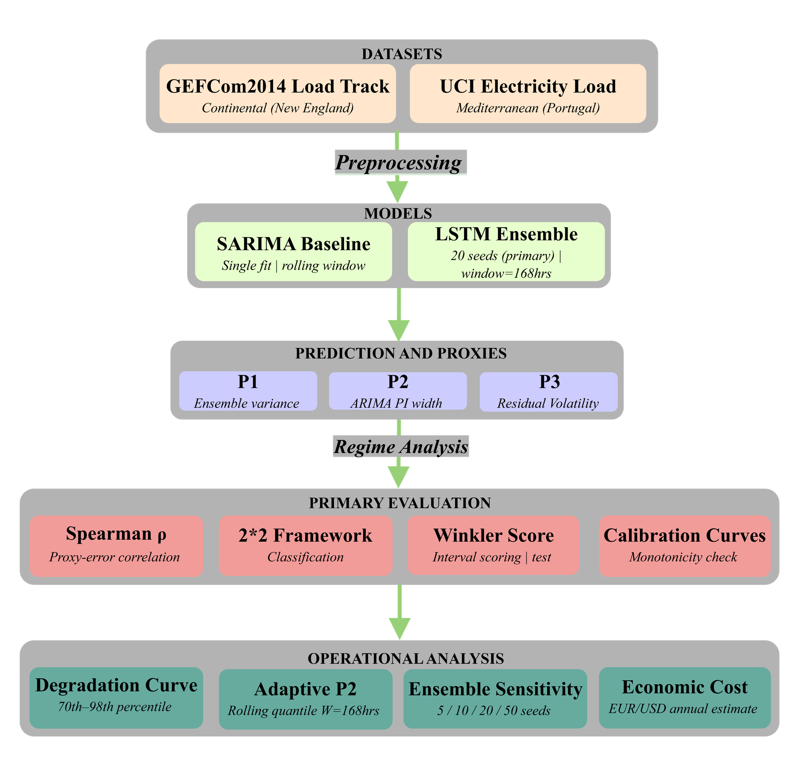

# Conditional Reliability of Uncertainty Proxies Under Extreme Demand
### A Cross-Grid Empirical Analysis of Load Forecasting

[](https://www.python.org/)
[](https://pytorch.org/)
[](LICENSE)
[]()

> This study empirically evaluates whether uncertainty proxies from AI load forecasting models provide reliable warnings during extreme demand conditions, the hours when grid operators need accurate confidence signals most. Using a 20-seed LSTM ensemble and SARIMA baseline across two geographically distinct grids (UCI Portugal and GEFCom2014 New England), we show that proxy reliability is grid-dependent: ensemble variance (P1) and residual volatility (P3) retain strong correlation with forecast error at extreme demand on the weather-sensitive New England grid (ρ=+0.482, ρ=+0.455) but collapse entirely on the stable Mediterranean Portuguese grid (ρ=+0.009, ρ=+0.044). Four extended analyse deepen these findings: proxy degradation curves reveal reliability collapse begins at the 81st demand percentile on UCI — before the operational threshold; ensemble sensitivity analysis across 5 to 50 seeds confirms P1 failure is fundamental not a configuration artefact; adaptive P2 remediation restores reliability on GEFCom2014 (ρ=+0.406) but worsens UCI operational risk; and economic cost analysis translates DANGEROUS rates into estimated annual reserve activation costs of EUR 73,636 (UCI) and USD 12,960 (GEFCom2014).
---

## Study Design



*Fig. 1. Study design and evaluation framework for cross-grid uncertainty proxy reliability analysis.*

---

## Research Questions

| RQ | Question |
|----|----------|
| RQ1 | Do LSTM forecast errors amplify during extreme demand hours? |
| RQ2 | Do uncertainty proxies correlate with forecast error at extreme demand? |
| RQ3 | Do proxies produce statistically significant overconfidence at extreme demand? |
| RQ4 | Which proxy method scores best under formal interval scoring? |
| RQ5 | Are proxy calibration curves monotonically increasing across demand regimes? |
| RQ6 | Does adaptive interval estimation remedy P2 failure, and does this depend on grid climate character? |

---

## Datasets

| Property | UCI Electricity Load Diagrams | GEFCom2014 Load Track |
|----------|------------------------------|----------------------|
| Grid | Portugal (Mediterranean) | New England ISO (Continental) |
| Period | 2011-2014 | 2007-2010 |
| Weather | None | 25 temperature stations |
| Test year | 2014 | 2010 |
| Test samples | 8,592 hours | 8,592 hours |
| Extreme threshold (90th pct) | 1,357.04 MWh | 237.60 MWh |
| Extreme hours in test | 876 (10.0%) | 877 (10.0%) |
| Source | [UCI ML Repository](https://archive.ics.uci.edu/dataset/321) | [Hong et al. 2016](https://doi.org/10.1016/j.ijforecast.2016.02.001) |

> **Note:** Raw datasets are not included due to licensing. See [Data Setup](#data-setup) below.

---

## Models and Proxies

**Primary forecaster:** Two-layer LSTM, 20-seed ensemble (PyTorch 2.0)
- Hidden size: 128 | Layers: 2 | Dropout: 0.2
- Input window: 168 hours (1 week) | Optimizer: Adam (lr=0.001)
- Early stopping: patience=10

**Baseline forecaster:** SARIMA fitted once per grid, evaluated on rolling window

**Uncertainty proxies evaluated:**

| Proxy | Method | Description |
|-------|--------|-------------|
| P1 | LSTM Ensemble Variance | Variance across 20 seed predictions |
| P2 | ARIMA Prediction Interval Width | Static PI width from single SARIMA fit |
| P3 | Residual Volatility | Rolling 24-hour std of LSTM residuals |
| CP | Conformal Prediction | Split conformal baseline (coverage 84.3% UCI, 87.5% GEFCom) |

---

## Key Results

### Primary Analysis
| Metric | UCI (Portugal) | GEFCom2014 (New England) |
|--------|---------------|--------------------------|
| LSTM MAE — normal demand | 16.86 MWh | 3.49 MWh |
| LSTM MAE — extreme demand | 21.32 MWh (+26.4%) | 5.42 MWh (+55.3%) |
| P1 Spearman ρ — all hours | +0.189 *** | +0.440 *** |
| P1 Spearman ρ — extreme hours | +0.009 (ns) | +0.482 *** |
| P3 Spearman ρ — extreme hours | +0.044 (ns) | +0.455 *** |
| P2 overconfidence OR (extreme) | 0.053 (ns) | 0.103 *** |
| Best Winkler score | Conformal: 166.2 | P3: 46.0 |
| Sensitivity at 95th pct (P1) | −0.110 (ns) | +0.423 *** |


### Extended Analysis
| Metric | UCI (Portugal) | GEFCom2014 (New England) |
|--------|---------------|--------------------------|
| P1 degradation threshold | 81st percentile | Significant all thresholds |
| P1 at 50 seeds | +0.077 (ns) | +0.540 *** |
| Adaptive P2 ρ — extreme hours | −0.004 (ns) | +0.406 *** |
| Adaptive P2 DANGEROUS rate | 12.21% (worsened) | 5.26% (improved) |
| P1 annual cost estimate | EUR 73,636 | USD 12,960 |

`***` p < 0.0001 | `ns` not significant after Bonferroni correction (α = 0.0083)
---

## Project Structure
```
├── data/
│   ├── uci/
│   │   ├── raw/                    # LD2011_2014.txt (not in repo)
│   │   ├── processed/              # Hourly aggregated features
│   │   └── splits/                 # Train / val / test splits
│   └── gefcom/
│       ├── raw/                    # GEFCom2014 task files (not in repo)
│       ├── processed/              # Hourly aggregated features
│       └── splits/                 # Train / val / test splits
├── experiments/
│   ├── 01_pilot_uci/               # Gate: Spearman rho > 0.10 on extreme hours
│   ├── 02_pilot_gefcom/
│   ├── 03_preprocess_uci/          # Aggregation, resampling, feature engineering
│   ├── 04_preprocess_gefcom/
│   ├── 05_lstm_uci/                # 20-seed LSTM training
│   ├── 06_lstm_gefcom/
│   ├── 07_arima_uci/               # SARIMA fit and evaluation
│   ├── 08_arima_gefcom/
│   ├── 09_proxies_uci/             # P1, P2, P3 computation
│   ├── 10_proxies_gefcom/
│   ├── 11_conformal_uci/           # Split conformal prediction
│   ├── 12_conformal_gefcom/
│   ├── 13_cross_dataset/           # Cross-grid comparison and evaluation
│   ├── 14_figures/                 # All 12 figure scripts (fig1–fig12)
│   ├── 15_degradation_curve/       # Extension 1 — proxy degradation curve
│   ├── 16_adaptive_p2/             # Extension 2 — adaptive P2 remediation
│   ├── 17_ensemble_sensitivity/    # Extension 3 — ensemble size sensitivity
│   ├── 19_economic_cost/           # Extension 4 — economic cost model
│   └── sensitivity_95.py           # 95th percentile threshold sensitivity
├── models/
│   ├── uci/
│   │   ├── lstm/                   # 20 seed checkpoints + all_predictions.npy
│   │   ├── arima/                  # SARIMA diagnostics
│   │   └── configs/                # LSTM config, scaler
│   └── gefcom/
│       ├── lstm/
│       ├── arima/
│       └── configs/
├── results/
│   ├── uci/
│   │   ├── figures/                # fig1–fig12 (PNG + PDF)
│   │   └── tables/                 # Proxy CSVs, conformal, evaluation
│   ├── gefcom/
│   ├── comparison/                 # Cross-dataset summary
│   ├── 15_degradation_curve/       # degradation_results.csv — 174 rows
│   ├── 16_adaptive_p2/             # adaptive_p2_results.csv — 4 files
│   ├── 17_ensemble_sensitivity/    # sensitivity_results.csv — 8 rows
│   ├── 19_economic_cost/           # economic_cost_results.csv — 6 rows
│   └── summary/
│       └── results_summary_FINAL.csv   # Single source of truth (4 rows x 93 cols)
├── docs/
│   ├── research_log.md             # Session-by-session decisions (Sessions 1–18)
│   ├── experiment_tracker.md       # Phase status and gate results
│   └── data_cards.md               # Full dataset documentation
├── logs/                           # LSTM, ARIMA, and sensitivity training logs
├── .gitignore
├── requirements.txt
└── README.md
```

---

## Data Setup

**UCI dataset:**
1. Download `LD2011_2014.txt` from [UCI ML Repository](https://archive.ics.uci.edu/dataset/321)
2. Place at `data/uci/raw/LD2011_2014.txt`

**GEFCom2014 dataset:**
1. Download from [Kaggle](https://www.kaggle.com/datasets/cthngon/gefcom2014-dataset) or the official competition archive
2. Place task files at `data/gefcom/raw/GEFCom2014 Data/Load/`

---

## Reproducing Results

### 1. Install dependencies
```bash
pip install -r requirements.txt
# PyTorch requires separate installation:
# https://pytorch.org/get-started/locally/
```

### 2. Preprocess
```bash
python3 experiments/03_preprocess_uci/preprocess_uci.py
python3 experiments/04_preprocess_gefcom/preprocess_gefcom.py
```

### 3. Train LSTM ensemble (20 seeds per grid)
```bash
python3 experiments/05_lstm_uci/train_all_seeds.py
python3 experiments/06_lstm_gefcom/train_all_seeds.py
```

### 4. Fit SARIMA baselines
```bash
python3 experiments/07_arima_uci/arima_uci.py
python3 experiments/08_arima_gefcom/arima_gefcom.py
```

### 5. Compute proxies and conformal intervals
```bash
python3 experiments/09_proxies_uci/compute_proxies.py
python3 experiments/10_proxies_gefcom/compute_proxies.py
python3 experiments/11_conformal_uci/conformal.py
python3 experiments/12_conformal_gefcom/conformal.py
```

### 6. Cross-dataset analysis and figures
```bash
python3 experiments/13_cross_dataset/cross_dataset.py
python3 experiments/14_figures/fig1_error_regime.py
python3 experiments/14_figures/fig2_proxy_scatter.py
python3 experiments/14_figures/fig3_heatmaps.py
python3 experiments/14_figures/fig3_hourly_seasonal_mae.py
python3 experiments/14_figures/fig4_ranking.py
python3 experiments/14_figures/fig5_calibration.py
python3 experiments/14_figures/fig6_sensitivity.py
```

### 7. Sensitivity analysis
```bash
python3 experiments/sensitivity_95.py
```

All verified results are stored in `results/summary/results_summary_FINAL.csv`.

---

## Requirements

- Python 3.10+
- PyTorch 2.0.1 (CUDA optional)
- See `requirements.txt` for full dependency list

---

## Citation

> Citation details will be added upon acceptance.

---

## Authors

**Dhan Ghale** — lead author  
Co-authors listed in the paper.

---

## License

MIT License — see [LICENSE](LICENSE) for details.

---

## Acknowledgements

- UCI Electricity Load Diagrams: Trindade, A. (2015). UCI Machine Learning Repository.
- GEFCom2014: Hong, T. et al. (2016). Probabilistic energy forecasting. *International Journal of Forecasting*, 32(3), 896-913.
